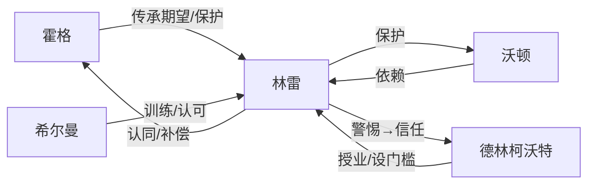

# 人物关系图：盘龙（开篇 1-23 章）

| 主体 | 关系动词 | 客体 | 起点 | 变化 | 当前状态 | 证据 |
|---|---|---|---|---|---|---|
| 霍格 | 传承期望 | 林雷 | 父子日常 | 揭示家族秘密、检测失败后安慰 | 共同承担复兴目标 | 第2-3、12-13章 A |
| 林雷 | 保护 | 沃顿 | 兄弟依恋 | 灾难中舍身护弟并受伤 | 保护义务被行动证实 | 第16-17章 A |
| 德林 | 授业 | 林雷 | 戒中陌生灵魂 | 身份确认、检测、训练 | 师徒关系建立 | 第18-23章 A |
| 林雷 | 信任 | 德林 | 警惕未知存在 | 接受检测与指导 | 有条件信任 | 第18-21章 A |
| 希尔曼 | 认可/训练 | 林雷 | 教官与学员 | 认可超龄毅力 | 早期成长见证者 | 第1章 A |

## 边界

关系表只表示节选截止状态；德林的长期动机与后续关系走向不得从开篇样本外推。

## 结构块证据回链

| 结构块 | 原文定位 | grep 关键词 | 置信度 |
|---|---|---|---|
| SB-001 | 原文/原文.txt:L1-L300 | 血脉检测 | A 明确 |
| SB-002 | 原文/原文.txt:L301-L521 | 盘龙戒指 | A 明确 |
| SB-003 | 原文/原文.txt:L522-L848 | 火蛇之舞 | A 明确 |
| SB-004 | 原文/原文.txt:L849-L1070 | 沃顿 | A 明确 |
| SB-005 | 原文/原文.txt:L1071-L1288 | 德林柯沃特 | A 明确 |
| SB-006 | 原文/原文.txt:L1289-L1418 | 撼地术 | A 明确 |
