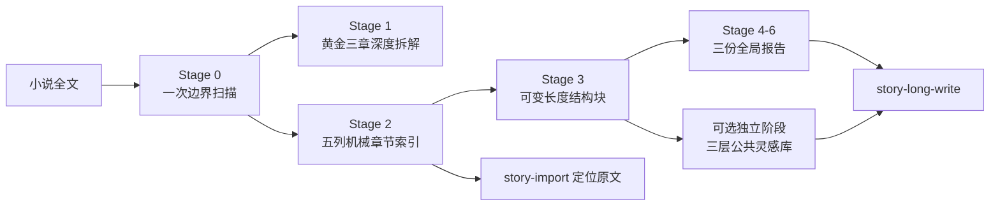

# oh-story V2 拆文重构更新说明

> 适用对象：项目维护者、测试人员、写作模块开发者，以及需要理解本次拆文架构变化的使用者。<br>
> 候选分支：`feature/analyze-hit-novel-refactor`<br>
> 当前状态：候选仓库存在未提交修改，本文说明的是当前候选实现与已完成的本地回归结果，不代表已经发布的正式版本。

## 一句话概括

本次更新把长篇拆文从“逐章生成大量详细分析”重构成了“黄金三章深拆＋一次机械索引＋可变结构块语义分析＋三份全局报告”，并增加独立的三层公共灵感库，使拆文结果既能服务后续写作，又避免反复读取全文和生成无人消费的中间稿。

## 为什么要改

旧流程的主要问题不是分析能力不足，而是运行方式与拆文目标不匹配：

1. 长篇正文可能被边界扫描、逐章摘要、章节卡、聚合分析和灵感提炼重复读取。
2. 非黄金章节生成过多逐章详细正文，耗时和 Token 与后续消费者的实际需求不成比例。
3. 人物关系、时间线和节奏分散在多个文件中，用户打开后仍需要自行拼接。
4. 中断恢复粒度不够明确，长任务可能从较早阶段重新开始。
5. 灵感提炼若在拆文后重新读取结构块或原文，会形成第二轮语义分析。
6. 写作与导入模块如果直接依赖逐章摘要，容易把压缩信息误当成原文事实。

因此，本次重构的目标不是“少分析”，而是让每一次正文读取都对应明确产物，并让同一份语义结果被多个下游模块复用。

## 新架构总览



新流程遵循四条核心原则：

- 全文边界只扫描一次。
- `chapter_index.csv` 只定位，不承载故事语义。
- 除黄金三章外，全书以结构块而不是单章作为最小语义单位。
- 灵感阶段只消费已有结构块和全局报告，不回读小说原文。

## 主要更新内容

### 1. 长篇拆文升级为单一分阶段管道

`story-long-analyze` 当前候选版本为 `1.2.0`。流程统一为：

1. 建立章节边界与源文件快照。
2. 深拆第1—3章并生成快速预览。
3. 用户确认后生成一次性五列章节索引。
4. 按情节闭环划分可变长度结构块。
5. 从结构块聚合六维拆书、爆款机制与证据边界。
6. 用户明确要求时，独立执行公共灵感库写入。

黄金三章仍保留原有的开篇钩子、人设、冲突、信息差和留存判断；第4章以后不再恢复逐章详细拆解正文。

### 2. 章节索引降级为纯机械定位层

`chapter_index.csv` 严格使用五列：

```csv
chapter,title,source_locator,char_count,status
```

它只回答：

- 这是第几章；
- 标题是什么；
- 原文位于哪里；
- 字符数是多少；
- 边界是否有效。

人物状态、事件摘要、情绪类型、剧情节点和历史事实不再写入章节索引。需要核实具体事实时，下游模块必须使用 `source_locator` 回读原文。

### 3. 以结构块代替逐章章节卡

结构块按照目标、压力、转折和兑现形成的情节闭环动态划分，不固定为每5章或每10章一块。

`structure_blocks.csv` 当前包含25列：

```csv
block_id,chapter_range,block_name,initial_gap,goal,pressure,turning_point,payoff,remaining_hook,state_change,main_characters,evidence_locator,plot_intensity,emotion_type,emotion_intensity,description_density,relationship_delta,rhythm_anchors,inspiration_title,inspiration_mechanism,inspiration_reader_effect,inspiration_transfer_boundary,inspiration_risk,confidence,status
```

每个结构块在同一次读取中同时提取：

- 关键事件闭环；
- 人物与关系状态迁移；
- 剧情、情绪和描写三维强度；
- 块内峰谷锚点；
- 一枚已经去除原作专名的灵感原子；
- 可回查的原文证据定位与置信度。

这样既保留了写作模块需要的阶段性信息，也避免重新生成一百多份逐章正文分析。

### 4. 六维内容合并为一份自包含报告

此前分散的人物、关系、冲突、双时间线和三维节奏，现在统一写入：

```text
全局分析/六维拆书.md
```

该文件必须自包含：

- 主要人物与人物弧；
- 完整有向人物关系图及演变；
- 核心冲突与冲突升级链；
- 故事客观时间线；
- 叙事披露顺序与信息边界；
- 题材、规模、商业亮点与风险；
- 剧情、情绪、描写三维节奏表；
- 可迁移规律与不可照搬边界。

不再要求用户在多个人物关系、时间线和节奏文件之间来回切换。

### 5. 全局产物收敛为三份文件

新拆文目录的核心全局产物为：

```text
全局分析/
├── 六维拆书.md
├── 爆款机制.md
└── 证据与边界.md
```

- `六维拆书.md`：完整理解这本书的结构和演变。
- `爆款机制.md`：提炼三套最有解释力、可迁移但不可照搬的商业机制。
- `证据与边界.md`：记录结论ID、原文定位、关键词、置信度、主线/IF边界和分析限制。

### 6. 增加断点保存与原子提交

长任务新增：

```text
_state_snapshot.json
_progress.json
```

断点记录包括：

- 原文与章节边界校验和；
- 当前阶段；
- 已提交的结构块范围；
- 待处理范围；
- 失败范围及原因；
- 已完成产物校验和；
- 下一步操作。

中断后从最近一个成功提交的结构块继续，不重新读取已完成范围。结构块哈希没有变化时，灵感原子也直接复用。

### 7. 新增运行时守卫

新增 `story-runtime-guard 1.0.0`，用于约束长任务的执行方式，而不改变拆文业务结构。

主要规则包括：

- 不复制无关历史上下文到分块任务；
- 一个结构块只有一个语义 owner；
- 成功读取过的章节范围不得再次读取；
- 不生成没有下游消费者的中间稿；
- 每个阶段先验证再原子提交；
- 中断恢复时只处理 `pending_ranges`；
- 机械索引、语义分析和灵感抽象各自只做一次。

这一层专门解决长篇任务中的重复读取、上下文膨胀和无效 Token 消耗。

## 新的拆文目录契约

```text
拆文库/{书名}/
├── 原文/
│   ├── 原始文件.txt
│   └── 原文.txt
├── 概要.md
├── 章节/
│   ├── 第1章_深度拆解.md
│   ├── 第2章_深度拆解.md
│   └── 第3章_深度拆解.md
├── 快速预览.md
├── chapter_index.csv
├── structure_blocks.csv
├── 全局分析/
│   ├── 六维拆书.md
│   ├── 爆款机制.md
│   └── 证据与边界.md
├── _state_snapshot.json
└── _progress.json
```

旧版演示文件可以作为只读兼容遗留保留，但不再属于新产物契约。

## 三层公共灵感库

新增独立技能 `story-inspiration-distill 1.1.0`。它不重新拆文，也不生成完整原创故事，只把拆文阶段已经得到的抽象机制转成可检索资产。

目录结构：

```text
灵感库/
├── 灵感索引.csv
├── 原子灵感/
│   └── {书名}/IA-001.md
├── 单小说灵感合并/
│   └── {书名}.md
├── 跨书灵感聚合/
│   └── CBA-001_{机制名}.md
└── _progress.json
```

### 第一层：原子灵感

- 英文：Inspiration Atom，简称 IA。
- 每个有效结构块机械生成一张原子卡。
- 标题、机制链、读者效果、迁移边界和风险直接来自结构块的五个 `inspiration_*` 字段。
- 本阶段不调用模型重新概括，不读取原文。

### 第二层：单小说灵感合并

- 英文：Single-Novel Inspiration Merge，简称 NM。
- 将同一本书中机制因果、读者需求和节奏形状相近的原子合并。
- 通常形成3—6个簇，无法合理合并的原子允许保留单成员簇。
- “来源数目”只是卡片中的统计字段，不再单独建立一层目录。

### 第三层：跨书灵感聚合

- 英文：Cross-Book Inspiration Aggregation，简称 CBA。
- 比较不同小说的NM，只读取索引命中的少量候选卡。
- 只有一部书支持时标记为“单书假设”。
- 两部及以上独立小说出现相同机制后，才能升级为“跨书重复验证”。
- 单本书最多激活3张最有复用价值的单书CBA，避免公共库被大量弱假设淹没。

### 标签召回

CBA使用受控标签轴：

- 题材；
- 读者需求；
- 情绪；
- 关系动作；
- 剧情功能；
- 节奏位置；
- 适用阶段；
- 风险。

写作模块只检索 `layer=跨书灵感聚合` 且 `status=active` 的卡片。IA和NM不直接进入正文上下文，也不作为文风样本。

## 对写作模块的影响

### story-long-write

后续写作可以消费：

- `全局分析/爆款机制.md`；
- `全局分析/六维拆书.md`；
- `structure_blocks.csv`；
- `chapter_index.csv` 中的原文定位；
- 按写作需求标签召回的少量active CBA。

写作模块不会把全部原子灵感塞入上下文，也不会沿CBA链接继续下钻NM和IA。

用户项目中的自定义文风仍保持最高优先级。公共灵感卡只提供机制参考，不能覆盖作者已确认的文风、角色设定、世界观或大纲事实。

### story-import

长篇导入仍可复用拆文资产，但五列章节索引只能用于定位原文。重建历史状态时必须回读对应原文片段，不能从CSV标题或压缩摘要凭空恢复人物状态、伏笔和时间线。

## 本次实际回归结果

### 《穿成财阀太子爷的作精前女友》

- 原文148章，主线1—144章，IF线145—148章。
- 只生成3份黄金章节深拆。
- `chapter_index.csv` 共148行、5列，章号连续。
- 全文划分为10个结构块，覆盖1—148章，无缺口、无重叠。
- `structure_blocks.csv` 为25列，强度数值均在1—5，证据定位均落在对应结构块范围内。
- 六维拆书已包含完整关系图、双时间线和三维节奏。
- 公共灵感库新增10张IA、4个NM。
- 3张既有CBA获得第二部小说支持，升级为跨书重复验证。
- 新增1张“亲密升级同时暴露秘密”单书假设。

### 当前公共灵感库

- 索引共50条。
- 新书全部10个有效结构块均对应一张IA。
- 每张IA至少归属一个NM。
- 每张CBA均能回链NM及其闭包内全部IA。
- 单书active CBA数量：旧书3张，新书1张，均未超过上限。
- 标签查询可以稳定召回“身份信息差”“规则反转”“高情绪售后”和“亲密升级暴露秘密”等机制。
- 官方 `inspiration_index.py validate` 与标签查询冒烟测试均已通过。

## 兼容迁移

早期《穿书兽世：恶雌她终于吃上好的了》的结构块仍使用18列旧表头。为让公共灵感库通过新版来源闭包验证，本次使用其已经存在的23张原子卡做了纯机械兼容迁移：

- 没有回读旧小说原文；
- 没有重新进行语义拆解；
- 原子标题、机制、读者效果、迁移边界和风险从现有IA卡回填；
- 关系迁移沿用旧版 `state_change`；
- 旧版没有记录的峰谷锚点明确标记为“旧版未记录”；
- 旧表迁移为25列后更新对应校验和。

这属于兼容性迁移，不应被理解为旧书已经获得与新流程完全相同的三维节奏精度。

## Token与运行时间为什么会下降

新流程减少的不是必要阅读，而是重复劳动：

| 旧式消耗 | 新处理方式 |
|---|---|
| 多次扫描全文章节边界 | 只扫描一次并保存快照 |
| 第4章以后逐章生成详细卡 | 改为五列机械索引＋结构块语义分析 |
| 同一段正文分别提取事件、关系、节奏和灵感 | 在同一次结构块读取中同时生成 |
| 灵感阶段再次读取全文 | 只机械读取 `inspiration_*` 字段 |
| 中断后从早期阶段重跑 | 从最近已提交结构块继续 |
| 全量灵感进入写作上下文 | 只按标签读取3—8张active CBA |

新增关系迁移、峰谷章节和灵感原子会让单个结构块的输出略有增加，但不会新增正文读取次数，因此总成本远低于恢复逐章详细章节卡。

## 当前边界与注意事项

1. 候选仓库修改尚未提交，不应视为正式发布版本。
2. 当前Windows环境没有可用Bash，涉及Bash的子测试只能跳过。
3. 可执行位断言属于Windows平台差异，不能直接视为业务失败。
4. 单书CBA只代表待验证假设，不能写成普遍市场规律。
5. 灵感库只保存机制，不复制原作专名、标志性台词、独有设定和具体事件链。
6. 灵感召回不能覆盖用户自定义文风、既定大纲和角色自主性。
7. 如果结构块证据不足，应回拆文阶段修复对应块，灵感模块不得自行回读原文补分析。

## 推荐使用顺序

```text
提供长篇全文
→ 运行 story-long-analyze
→ 查看黄金三章与快速预览
→ 确认继续
→ 完成五列索引、结构块和三份全局报告
→ 按需运行 story-inspiration-distill
→ 写作阶段按标签召回少量CBA
→ 依据大纲和原文证据进入 story-long-write / story-import
```

## 最终变化总结

这次更新完成了三个层面的重构：

1. **拆文层**：从逐章堆积改为黄金三章＋结构块，保留关键语义，删除低消费价值的详细章节卡。
2. **运行层**：加入一次读取、断点恢复、原子提交和无历史分叉规则，控制长任务的时间与Token成本。
3. **复用层**：把每个结构块的灵感原子汇总成单小说机制，再通过受控标签聚合跨书规律，为写作模块提供可检索而不过量的灵感输入。

最终目标不是产出更多分析文件，而是让拆文得到的每一条信息都有清晰消费者、可回查证据和明确复用边界。
